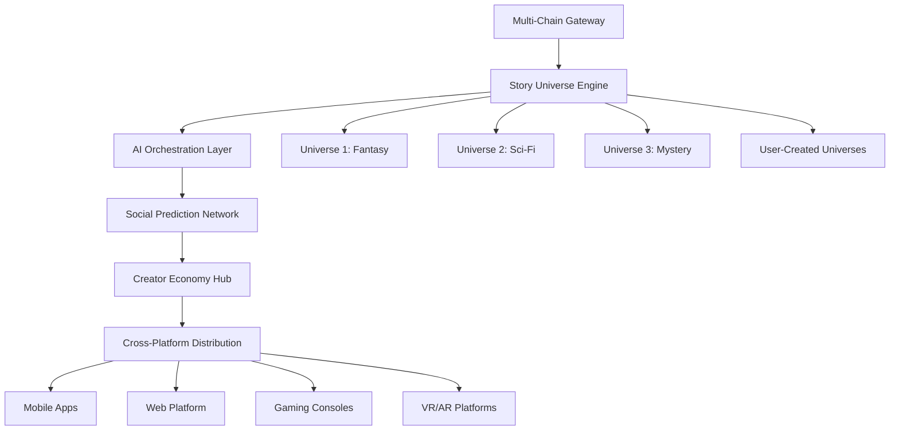

# 🚀 Story-Forge: Billion-Dollar Transformation Strategy

*"From Interactive Novel to Global Entertainment Empire"*

---

## 🎯 **EXECUTIVE SUMMARY**

Story-Forge has the foundation to become the **Netflix of Interactive AI Entertainment**. By combining prediction markets, creator economy, and viral social mechanics, we can build a $1B+ platform that revolutionizes digital storytelling.

**Current Valuation Potential:** $50-100M (solid Web3 gaming project)  
**Target Valuation:** $1B+ (entertainment/gaming unicorn)  
**Timeline:** 18-24 months with aggressive execution

---

## 📊 **MARKET OPPORTUNITY**

- **Gaming Industry:** $321B (2023)
- **Streaming Entertainment:** $223B (2023) 
- **NFT/Web3 Gaming:** $4.8B (2024)
- **Prediction Markets:** $350M (rapidly growing)

**Our TAM:** $50B+ (intersection of gaming, entertainment, social, prediction markets)

---

## 🔥 **CORE VALUE PROPOSITIONS**

### 1. **Viral Social Prediction Engine**
- **Netflix meets TikTok** - shareable story moments with betting
- **Influencer Integration** - Creator partnerships for massive reach  
- **Social Competitions** - Guild vs Guild predictions, tournaments

### 2. **Creator Economy Revolution**  
- **User-Generated Universes** - Anyone can create monetized story worlds
- **Revenue Sharing Model** - 50/30/20 split (creators/predictors/platform)
- **Cross-Story Ecosystem** - Characters and items move between universes

### 3. **AI-Powered Personalization**
- **Individual Story Paths** - AI adapts to user preferences
- **Predictive Analytics** - ML models optimize engagement and retention
- **Dynamic Difficulty** - Betting odds adjust to user skill level

---

## 🏗️ **TECHNICAL ARCHITECTURE EVOLUTION**

### Current State ✅
- Solid NestJS/Next.js foundation
- Basic prediction market mechanics
- NFT integration
- Single-story universe

### Billion-Dollar Architecture 🚀



---

## 💰 **TOKENOMICS 2.0: $STORY ECOSYSTEM**

### **$STORY Token Utility**
- **Governance:** Vote on story directions, platform features
- **Staking:** Earn yield + voting power + creator revenue share
- **Creator Rewards:** Payment for story creation and moderation
- **Premium Features:** Advanced analytics, early access, custom avatars

### **Economic Model**
```
Revenue Streams:
├── Transaction Fees (2-5% of betting volume)
├── Creator Universe Licensing (30% of user-generated content revenue)
├── Premium Subscriptions ($9.99/month for advanced features)
├── NFT Marketplace (2.5% trading fees)
├── Enterprise Partnerships (white-label licensing)
└── Advertising/Sponsorships (brand integration in stories)

Target Metrics:
- 10M+ Monthly Active Users
- $500M+ Annual Betting Volume  
- $100M+ Creator Economy Revenue
- 1M+ NFTs Minted Monthly
```

---

## 🎮 **GAMING MECHANICS ENHANCEMENT**

### **Achievement System**
- **Prediction Streaks:** Reward consecutive correct predictions
- **Story Completion:** NFT rewards for finishing story arcs
- **Social Influence:** Badges for bringing friends, creating viral moments
- **Creator Milestones:** Special NFTs for successful story creators

### **Competitive Elements**
- **Leaderboards:** Daily/weekly/monthly prediction champions
- **Guild System:** Team-based prediction tournaments
- **Season Competitions:** Quarterly events with massive prize pools
- **Cross-Universe Challenges:** Predict outcomes across multiple stories

### **Progression Systems**
- **Experience Points:** Gain XP for predictions, social interactions
- **Skill Trees:** Unlock specialized prediction abilities
- **Character Customization:** Avatar progression tied to achievements
- **Story Influence:** Top predictors influence future story directions

---

## 📱 **PLATFORM EXPANSION STRATEGY**

### **Phase 1: Core Platform Optimization (Q1-Q2 2025)**
- ✅ Mobile-responsive PWA
- ✅ Advanced AI story generation (GPT-4, Claude 3.5)
- ✅ Social sharing mechanics
- ✅ $STORY token launch
- ✅ Creator onboarding tools

### **Phase 2: Creator Economy Launch (Q3-Q4 2025)**
- 🚧 User-generated story universes
- 🚧 Revenue sharing implementation  
- 🚧 Advanced NFT ecosystem
- 🚧 Cross-story betting markets
- 🚧 Mobile apps (iOS/Android)

### **Phase 3: Mass Adoption (Q1-Q2 2026)**
- ⏳ Multi-chain deployment (Polygon, Arbitrum, Solana)
- ⏳ Gaming console integration
- ⏳ Enterprise partnerships (Netflix, Disney+, etc.)
- ⏳ VR/AR story experiences
- ⏳ AI-powered personalization engine

### **Phase 4: Global Domination (Q3-Q4 2026)**
- ⏳ International expansion (Asia, Europe, LATAM)
- ⏳ Educational platform partnerships  
- ⏳ White-label enterprise solutions
- ⏳ Metaverse integration
- ⏳ IPO readiness

---

## 🤝 **STRATEGIC PARTNERSHIPS**

### **Content Creators**
- **Top Web3 Influencers:** Collaborate on exclusive story universes
- **Traditional Authors:** Bring established IP into the platform
- **Game Developers:** Create interactive story-game hybrids

### **Technology Partners**
- **AI Companies:** Advanced language models and personalization
- **Blockchain Infrastructure:** Scaling and multi-chain support
- **Gaming Engines:** Unity/Unreal integration for immersive experiences

### **Entertainment Industry**
- **Streaming Platforms:** Content licensing and co-production deals
- **Traditional Media:** IP partnerships and cross-promotion
- **Gaming Publishers:** Distribution and marketing partnerships

### **Enterprise Clients**
- **Educational Institutions:** Interactive learning platforms
- **Corporate Training:** Gamified professional development
- **Marketing Agencies:** Brand storytelling and engagement

---

## 📈 **GROWTH METRICS & MILESTONES**

### **Year 1 Targets (2025)**
- 👥 **Users:** 100K → 1M Monthly Active Users
- 💰 **Revenue:** $1M → $25M Annual Recurring Revenue
- 📊 **Betting Volume:** $10M → $150M annually
- 🎨 **Content:** 10 → 500+ story universes
- 🏆 **Valuation:** $50M → $250M

### **Year 2 Targets (2026)**
- 👥 **Users:** 1M → 10M Monthly Active Users  
- 💰 **Revenue:** $25M → $200M Annual Recurring Revenue
- 📊 **Betting Volume:** $150M → $1B annually
- 🎨 **Content:** 500 → 5000+ story universes
- 🏆 **Valuation:** $250M → $1B+ (Unicorn Status)

### **Key Performance Indicators**
- **User Engagement:** Average session time, daily active users
- **Monetization:** Revenue per user, betting frequency
- **Content Quality:** Story completion rates, user ratings
- **Social Virality:** Share rates, referral conversion
- **Creator Economy:** Active creators, revenue sharing effectiveness

---

## 🔥 **VIRAL GROWTH STRATEGIES**

### **Social Media Integration**
- **TikTok Challenges:** #StoryForgePrediction viral campaigns
- **Twitter Integration:** Real-time prediction sharing and debates
- **Discord Communities:** Creator and fan guild coordination
- **Instagram Stories:** Visual story moments and prediction results

### **Influencer Partnerships**
- **Tier 1 Creators:** Exclusive story universe collaborations
- **Gaming Streamers:** Live prediction tournaments and reactions
- **Educational Content:** "How I Made $10K Predicting Stories" content
- **Celebrity Endorsements:** High-profile personalities creating stories

### **Gamification Mechanics**
- **Referral Rewards:** Bonus tokens for successful friend invitations
- **Social Achievements:** Badges for community engagement
- **Viral Moments:** Special rewards for creating shareable content
- **FOMO Mechanics:** Limited-time events and exclusive access

---

## 🛠️ **IMPLEMENTATION PRIORITY MATRIX**

### **🔴 Critical (Implement Immediately)**
1. **$STORY Token Integration** - Foundation for entire economy
2. **Social Sharing Mechanics** - Viral growth driver
3. **Mobile Optimization** - 80% of users are mobile-first
4. **Creator Onboarding Tools** - Content supply scaling

### **🟡 High Priority (Q1 2025)**
1. **Multi-Story Universe Support** - Platform scalability
2. **Advanced AI Personalization** - User retention
3. **Guild/Social Features** - Community building
4. **Cross-Chain Deployment** - Market expansion

### **🟢 Medium Priority (Q2 2025)**
1. **NFT Ecosystem Expansion** - Additional revenue streams  
2. **Enterprise Partnership Tools** - B2B scaling
3. **Advanced Analytics Dashboard** - Creator insights
4. **Gaming Console Integration** - New user acquisition

### **🔵 Future Features (Q3+ 2025)**
1. **VR/AR Story Experiences** - Next-generation engagement
2. **AI-Generated Voice Acting** - Immersive storytelling
3. **Metaverse Integration** - Web3 ecosystem positioning
4. **Educational Platform Licensing** - Alternative market penetration

---

## 💡 **INNOVATION OPPORTUNITIES**

### **AI Technology Advances**
- **GPT-5 Integration:** When available, upgrade to most advanced AI
- **Multimodal Stories:** Integrate AI-generated images, audio, video
- **Real-time Adaptation:** Stories that evolve based on live user reactions
- **Predictive Analytics:** AI that optimizes story paths for maximum engagement

### **Blockchain Technology**
- **Layer 2 Solutions:** Reduce transaction costs and improve speed
- **Cross-Chain Bridges:** Seamless asset transfer between networks
- **Zero-Knowledge Proofs:** Enhanced privacy for sensitive user data
- **Decentralized Storage:** IPFS and Arweave integration for content permanence

### **Emerging Platforms**
- **Apple Vision Pro:** Immersive story experiences in spatial computing
- **Meta Quest:** VR storytelling and prediction environments
- **Gaming Handhelds:** Steam Deck, Nintendo Switch integration
- **Smart TVs:** Living room story experiences with family betting

---

## 🎯 **SUCCESS METRICS DASHBOARD**

### **User Acquisition**
- **CAC (Customer Acquisition Cost):** Target <$10
- **LTV (Lifetime Value):** Target >$200  
- **Viral Coefficient:** Target 1.5+ (each user brings 1.5 more)
- **Retention Rate:** Target 70% Month 1, 40% Month 3

### **Engagement Metrics**
- **Daily Active Users / Monthly Active Users:** Target >30%
- **Average Session Time:** Target >45 minutes
- **Stories per User per Month:** Target >10
- **Predictions per User per Day:** Target >3

### **Financial Performance**
- **Monthly Recurring Revenue Growth:** Target >20% MoM
- **Gross Margin:** Target >85% (software/digital goods)
- **Unit Economics:** Target 3:1 LTV:CAC ratio
- **Revenue Diversification:** No single stream >60% of total

---

## 🚨 **RISK MITIGATION**

### **Technical Risks**
- **AI Hallucination:** Implement content moderation and quality checks
- **Blockchain Congestion:** Multi-chain strategy and Layer 2 solutions
- **Scaling Challenges:** Microservices architecture and cloud infrastructure
- **Security Vulnerabilities:** Regular audits and bug bounty programs

### **Market Risks**
- **Regulatory Changes:** Legal compliance team and multi-jurisdiction strategy
- **Competition:** Focus on moat-building through network effects
- **Economic Downturn:** Diversified revenue streams and cost optimization
- **Technology Obsolescence:** Continuous innovation and R&D investment

### **Business Risks**
- **Creator Dependency:** Large creator pool and revenue sharing incentives
- **User Churn:** Engagement optimization and personalization
- **Token Volatility:** Stablecoin options and utility-first tokenomics
- **Partnership Failures:** Multiple partnership tracks and contingency plans

---

## 🏆 **THE BILLION-DOLLAR VISION**

By 2026, Story-Forge will be the **definitive platform for interactive entertainment**, combining the engagement of TikTok, the monetization of OnlyFans, the virality of YouTube, and the innovation of blockchain technology.

**Our users will:**
- Spend hours daily engaged in personalized story universes
- Earn meaningful income through prediction skills and content creation
- Build lasting communities around shared narrative experiences
- Own valuable digital assets that appreciate over time

**Our creators will:**
- Build sustainable businesses through story monetization
- Reach global audiences without traditional gatekeepers  
- Collaborate on interconnected universe development
- Share in platform success through token appreciation

**Our platform will:**
- Process billions in annual betting volume
- Host thousands of concurrent story universes
- Support millions of active community members
- Generate hundreds of millions in sustainable revenue

---

*"The future of entertainment isn't passive consumption—it's active participation in the stories that shape our world."*

**Let's build the future. Let's build Story-Forge.** 🚀✨

---

## 📞 **NEXT STEPS**

1. **Review Strategy:** Team alignment on billion-dollar vision
2. **Prioritize Implementation:** Focus on critical path items  
3. **Resource Allocation:** Hiring plan for key technical roles
4. **Partnership Outreach:** Begin conversations with strategic partners
5. **Community Building:** Start building anticipation and early adopters

**The opportunity is massive. The foundation is solid. The time is now.**